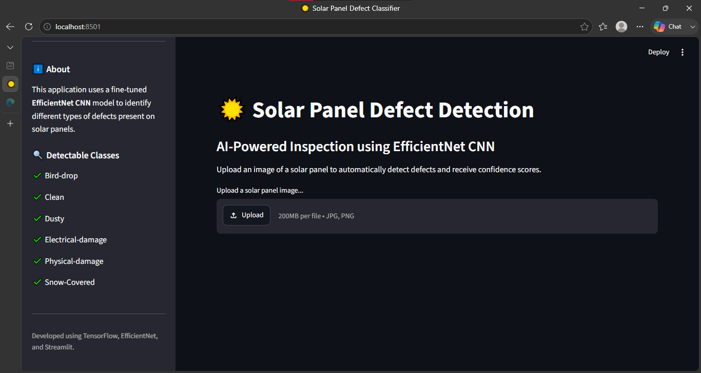
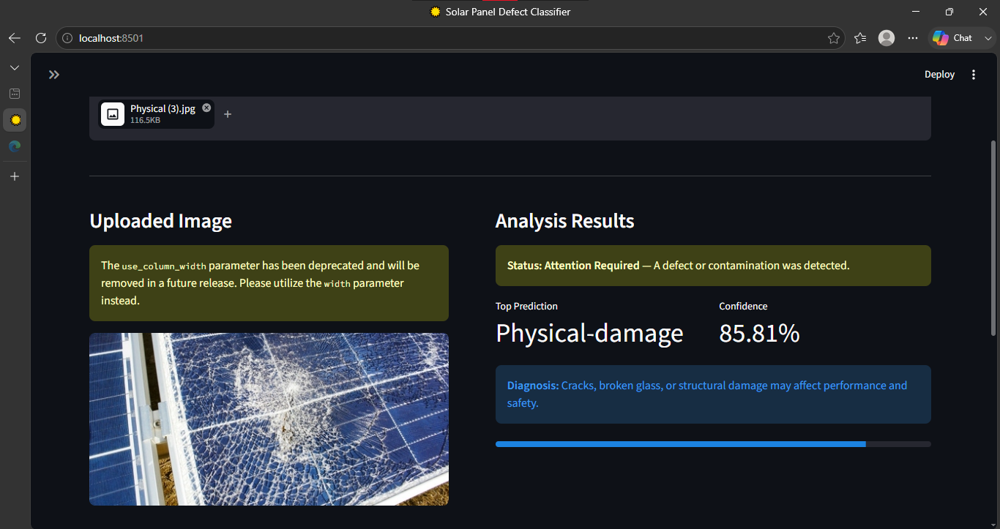
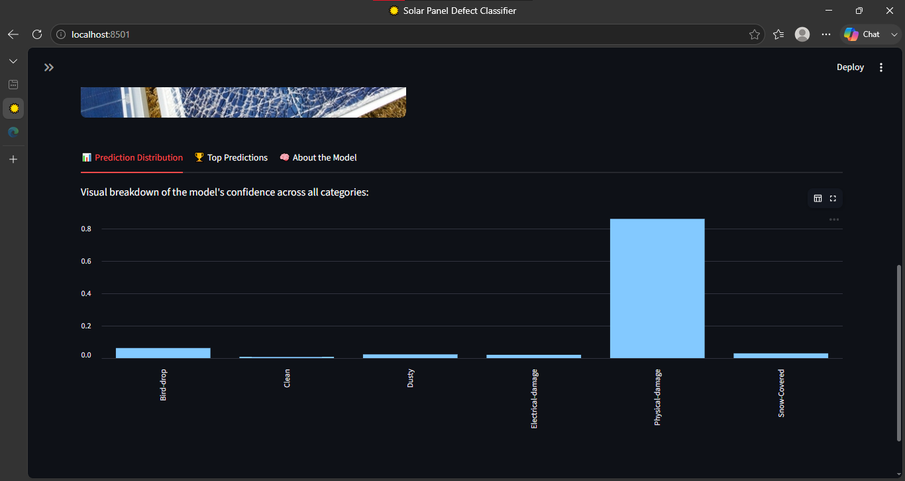
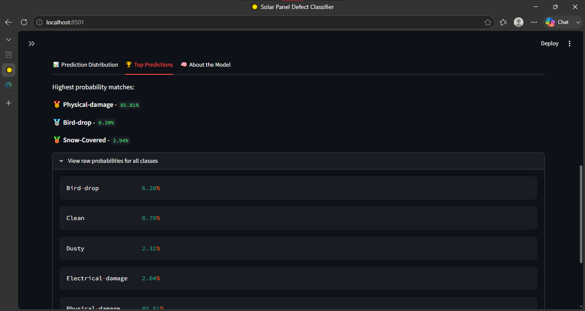
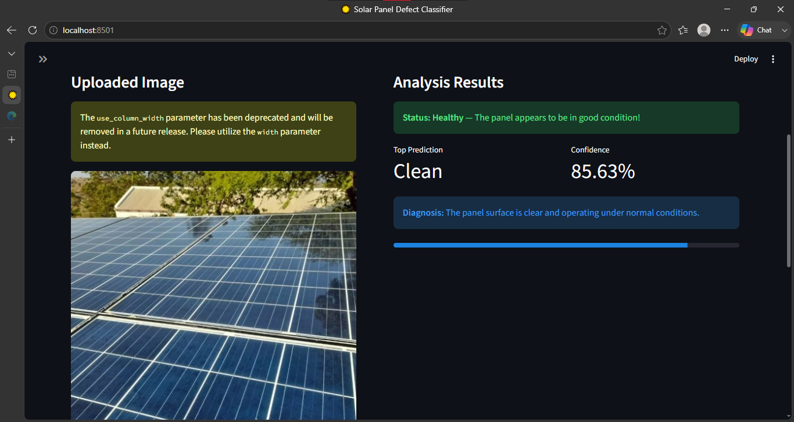
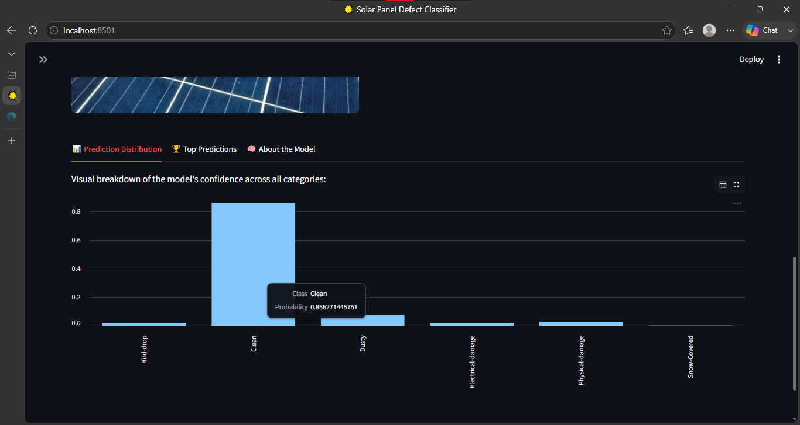
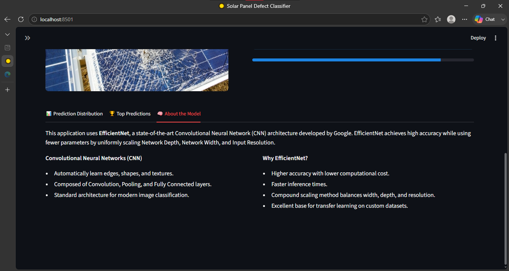

# ☀️ Solar Panel Defect Classification using EfficientNet

An AI-powered deep learning application that automatically detects and classifies defects in solar panels from images.

The project uses **TensorFlow**, **EfficientNet**, and **Streamlit** to provide a simple web interface for real-time prediction.

---

## Features

- Detects multiple solar panel defect classes
- Built with EfficientNet Transfer Learning
- User-friendly Streamlit interface
- Image upload and instant prediction
- Optimized using Hyperparameter Tuning
- Ready for deployment

---

## Dataset

The dataset contains six classes:

- Bird-drop
- Clean
- Dusty
- Electrical-damage
- Physical-Damage
- Snow-Covered

> Dataset is not included because of its large size.

---

## Model

Architecture:

- EfficientNet
- Transfer Learning
- Data Augmentation
- Dropout
- Dense Layers
- Hyperparameter Optimization

---

## Application Preview

### Home Page



### Prediction Result









## Technologies Used

- Python
- TensorFlow
- Keras
- Streamlit
- NumPy
- PIL
- Matplotlib

---

## Project Structure

```

Solar-Panel-Defect-Classification
│
├── app.py
├── requirements.txt
├── trained_effnet_finetune.h5
├── Solar_Panel_Classification.ipynb
├── README.md
├── images/
└── .gitignore

```

---

## Installation

Clone the repository

```bash
git clone https://github.com/VisheshJain28/Solar-Panel-Defect-Classification.git
```

Go inside the folder

```bash
cd Solar-Panel-Defect-Classification
```

Install dependencies

```bash
pip install -r requirements.txt
```

Run the application

```bash
streamlit run app.py
```

---

## Results

Best Validation Accuracy

```
83.05%
```

---

## Future Improvements

- Better accuracy using larger datasets
- Explainable AI (Grad-CAM)
- Object Detection
- Mobile Deployment
- Cloud Deployment

---

## Author

**Vishesh Jain**

GitHub

https://github.com/VisheshJain28

LinkedIn
